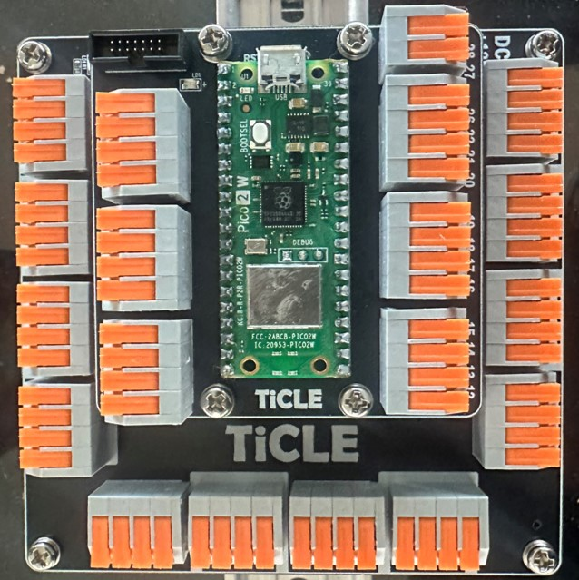

# TiCLE Sensor 

TiCLE Sensor 는 물류 및 제조 센싱 시나리오를 별도의 납땜이나 브레드 보드 없이 구현해 볼 수 있는 모듈형 피지컬 컴퓨팅 실습장비 입니다. 

TiCLE Sensor 의 특징을 정리하면 다음과 같습니다. 

- 납땜·브레드보드 없이 물류·제조 센싱 시나리오를 즉시 구현하는 모듈형 피지컬 컴퓨팅 실습 장비.
- Dual-Core ARM Cortex-M33 메인 프로세서 채택으로 실시간/비실시간 작업 분리 지원.
- 레버 커넥터 기반 자유 배선으로 센서·액추에이터 신속 교체, PBL 반복 실험 최적화.
- 객체 식별, 거리·위치·자세·속도 인식 센서와 구동/피드백 액추에이터를 함께 제공하여 고급 PBL 프로젝트 구현 가능.
- 전원 모듈로 다양한 장치에 대응
- Pop Plus 라이브러리로 MicroPython에서 센싱→제어→액추에이터를 몇 줄로 파이프라인화, 피지컬 AI 메이킹까지 자연스럽게 확장 가능.
- SSL/TLS 암호화·인증, QoS/주제별 ACL을 지원하는 오픈소스 MQTT 브로커 제공.
- 실시간 로그·시리얼 콘솔·펌웨어 전송·패키지 관리를 포함한 Python/MicroPython 통합 개발 환경 제공.
- Blynk 예제로 Android/iOS 원격 제어 GUI를 노코드로 구성.
- PySide6·비전 퍼셉션·AI STT 기반 피지컬 인공지능 응용 예제 제공.

## TiCLE Sensor List 
### T-Core & T-Power

T-Core는 제공되는 I/O 포트등을 통해 산업 현장의 다양한 장치를 제어할 수 있습니다. IO 포트를 통해 스위치, 환경 센서 등을 연결하여 다양한 상황을 감지하고 대응할 수 있으며, 각종 액츄에이터를 연결하여 동작을 제어할 수 있습니다. 

T-Power는 다양한 전원이 필요한 모듈에 대응할 수 있는 장치로, 12V, 5V, 3.3V 를 모두 지원하여 원하는 모듈을 알맞는 전원에 활용할수 있도록 지원하는 보드입니다. 

### Object Detection Module 

Object Detection Module은 주변 물체 감지 용도로 활용되는 센서를 모아둔 모듈로 Proximity, Color, Motion 센서가 포함되어 있습니다. 

### Distance Measurement Module 

Distance Measurement Module은 물체까지의 거리를 정랼적으로 측정하는 센서가 포함된 모듈로 초음파 센서와 ToF 센서가 포함되어 있습니다. 

### Positioning Module 

Positioning Module은 로봇이나 기기의 위치, 방향, 자세를 파악할수 있는 센서가 포함된 블록으로 관성 센서가 포함되어 있습니다. 

### Identification Module 

이 모듈은 물체나 사용자를 인식/식별 하는 모듈로 출입 인증, 물류 관리등에 활용할 수 있습니다. 

### Positioning & Speed Measurement Module 

모터의 축의 회전 각도 및 속도를 정확하게 측정하는 모듈로 자기장 센서를 이용하여 회전 각도와 회전 속도를 디지털로 출력 합니다. 

### Vision Module 

카메라 기반의 QR 코드, 바코드 등의 패턴 분석 모듈입니다. 

### Environmental Stability Module 

주변 환경을 계측하여 시스템이 환경에 적응 할 수 있도록 지원하는 블록입니다. 온도, 습도, 가스, 기압, 소리, 먼지, 조도 측정이 가능합니다.

### Actuator Module

센서로 부터 얻은 정보를 기반으로 실제 동작을 수행하는 블록입니다. RGB LED, TextLCD, Joystick & Button, Lamp, Motor, Piezo Buzzer가 포함됩니다. 

