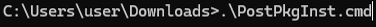
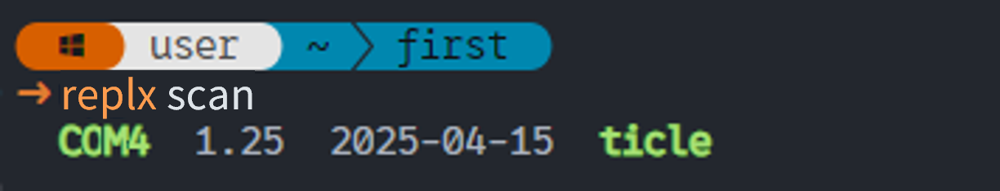

# 실습 환경 

## Visual Studio Code

Visual Studio Code(VSCode) 란 MS에서 Electron 프레임워크를 기반으로 개발된 무료 프로그램으로으로 추가로 원하는 확장 기능을 설치해야 IDE로 사용 가능합니다. 윈도우를 비롯해 리눅스 Mac을 모두 지원하며 파이썬을 비롯해 다양한 언어와 부가 기능을 수 많은 확장 기능으로 지원합니다.

### VSCode 설치 및 세팅

상술하였듯 VSCode 편집기를 IDE로 사용하기 위해선 다양한 Extension들을 설치해주고 직접 설정해주어야 하는 불편함이 있습니다. 한백전자에서는 이러한 불편함을 해소시키기 위해 Windows에서 VSCode 및 pwsh 등 여러 편리한 개발환경들을 자동으로 설치해주는 스크립트를 제공합니다. 설치하는 방법은 다음과 같습니다.

1. 위 링크에 접속한 후 설치에 필요한 zip 파일을 다운로드 받습니다. 그 후, 압축을 해제합니다.


&nbsp; [Installation files](https://github.com/hanback-lab/TiCLE/blob/main/tools/Environment_Install.zip)

2. 파일 탐색기를 열어 배치파일을 설치한 위치로 이동한 뒤, 탐색기 주소창에 'cmd' 라고 입력하여 명령 프롬프트 창을 띄웁니다.


<br>

3. 다음 명령어들을 순차적으로 실행합니다.

```
.\PrePkgInst.cmd
.\VSCodeInst.cmd
.\PostPkgInst.cmd
```




이 후, 파일 탐색기를 열어 다음 경로로 이동합니다.

```
C:\VSCode\
```

Code.exe 파일을 실행시켜 VSCode를 실행시킵니다.

### replx

replx는 MCU 보드에 구축된 Micropython 환경에서의 프로그래밍을 보조하는 개발 툴입니다. 이 툴은 다양한 기능을 제공하고 빠른 속도로 동작하여 개발자로부터 하여금 편의성을 증진시켜줄 수 있습니다.

replx에 대한 자세한 사용법은 아래 사이트에서 확인하실 수 있습니다.

- https://github.com/PlanXLab/replx_libs

#### 기능

제공되는 기능은 다음과 같습니다.
- **간편한 프로그램 실행** : 높은 추상화 및 간편한 환경설정들로 인해 보드 위에서의 Micropython 프로그램 실행의 간편성을 대폭 높입니다.
- **사용자 맞춤 환경설정** : 사용자 맞춤 설정을 통해 필요한 설정값을 미리 저장해 편의성을 증가시킬 수 있습니다.
- **강력한 보드 제어** : Soft Reset, Repl 접속 등 보드를 간단하고도 강력하게 제어할 수 있습니다.
- **저장소 접근 및 관리** : 보드의 저장소에 접근하고 파일들을 관리할 있어 라이브러리 업로드 등 보드의 활용도를 대폭 높일 수 있습니다.
- **자동 업데이트** : 업데이트 버전 등록 시 자동으로 감지하고 설치를 진행합니다.

#### 설치 방법

replx 툴은 파이썬 패키지로써 Pypi에 등록되어 있어, pip로 간편하게 설치할 수 있습니다. 단, 다음 조건을 충족해야 합니다.

- Windows 11 이상
- **Python 3.10 이상**

```
pip install replx
```

### replx 사용

우선, VSCode 상에서 작업할 위치에 폴더를 엽니다.


<br>

아래 사진과 같이 TiCLE Core의 USB 포트와 PC간의 연결 상태를 확인합니다. 그 후 터미널에 다음 명령어를 입력하여 PC에 연결된 보드의 시리얼 포트를 확인합니다.


```
replx scan
```



<br>

시리얼 포트를 확인하였다면 다음 명령어를 입력하여 현재 Workspace에 보드의 시리얼 포트 정보를 저장합니다. 

```
replx -s <시리얼 포트> env
```


<br>

환경 설정이 완료되었다면 TiCLE Lite를 초기화시킵니다. TiCLE Lite를 사용하기 위한 시스템 초기화 및 기본 라이브러리가 설치됩니다. 

```
replx init
```


### Hello World!

다음은 Micropython 프로그램을 작성하고 TiCLE Lite에 업로드하는 실습입니다. 

먼저 간단한 프로그램을 작성합니다. VSCode 왼쪽 상단에 'New File' Icon을 눌러 새 파일을 생성한 다음, 'main.py' 라고 이름을 지정합니다.

   
<br>

<br><br>


파일을 아래와 같이 작성합니다.

```python
print("Hello World!")
```

<br>

다음 명령어를 입력하여 프로그램 동작 결과를 확인합니다.

```
replx run main.py
```
